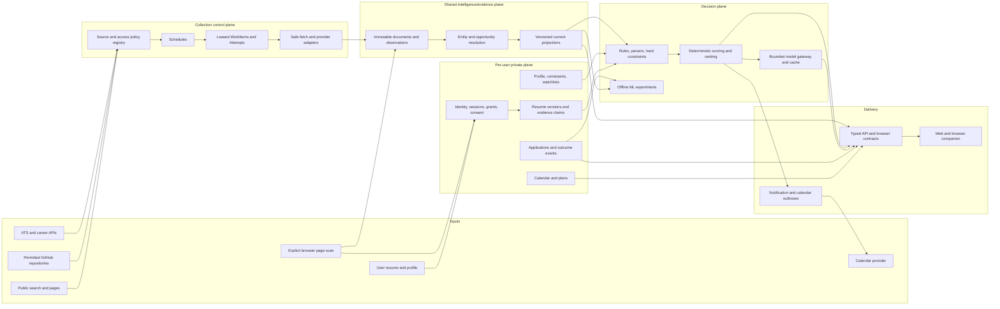

# RecruitIntel final architecture and reuse roadmap

Audited on 2026-08-20 against the implemented RecruitIntel repository through
Milestone 5 and every repository then present in
`/Users/jaynapatel/Desktop/github repos`.

This is a planning and licensing analysis. It does not authorize a code import,
does not replace legal review, and did not modify production code or the
Claude-owned frontend. Root repository licenses, nested code licenses, datasets,
models, fonts, fixtures, and provider terms are treated as separate rights.

Implementation status update (2026-08-21): Gate 5.1 and Milestone 6 are complete. Milestone 6
replaced the configured owner/static admin runtime with authenticated users, hashed scoped service
principals, compound private ownership, privacy/audit/redaction foundations, and current-behavior
instrumentation. The refined operational contract is in `docs/identity-privacy-audit.md`; Milestone
7 remains the next unstarted milestone.

## 1. Current system map

### Runtime topology

RecruitIntel is a PostgreSQL-centered monorepo with three implementation layers:

- `apps/web`: Next.js 16 pages and route handlers. Route handlers validate with
  shared Zod schemas and return `{data, meta?}` or
  `{error: {code, message}}` envelopes.
- `packages/db`, `packages/types`, and `packages/shared`: hand-written SQL access,
  TypeScript contracts, shared normalization, and five sequential SQL migrations.
- `services/collectors`: finite Python commands for ATS, GitHub, public-web,
  recruiter/campus processing, and Google Calendar synchronization. PostgreSQL is
  both the system of record and the durable-work coordination store.

There is no continuous scheduler or dispatcher. Every worker is invoked with an
explicit source, repository, observation, or request ID. Public-web and calendar
requests have retry windows, but a process that dies after claiming work can
leave the row `RUNNING` indefinitely because there is no lease, heartbeat, or
startup repair.

### What Milestones 1-5 actually provide

| Milestone | Implemented capability                                                                                                                                                                                                                                             | Important boundary                                                                                                                                                                                                                                                                             |
| --------- | ------------------------------------------------------------------------------------------------------------------------------------------------------------------------------------------------------------------------------------------------------------------ | ---------------------------------------------------------------------------------------------------------------------------------------------------------------------------------------------------------------------------------------------------------------------------------------------- |
| 1         | Company/alias/domain identity; Sources; collector runs/errors; current Jobs; immutable snapshots, observations, and recruiting events; Greenhouse and Lever collection; deterministic normalization/classification/fingerprints; complete-batch close/reopen       | The ATS enum names more providers than the two implemented adapters. A Job is a source posting, unique only by `(source_id, external_id)`; there is no cross-source opportunity identity.                                                                                                      |
| 2         | Official GitHub API ingestion; commit-aware repository/path sync; Markdown/CSV/JSON job and interview parsers; canonical interview questions plus company links and commit-specific observations; unresolved records                                               | GitHub jobs are not closed when rows disappear. Interview `observation_count` counts persistence across repository commits, not independent interview reports, and must not be presented as empirical interview probability.                                                                   |
| 3         | Search-query, candidate, discovery, document, observation, claim, and durable-work pipeline for public web intelligence; SSRF/redirect/robots/rate/size controls; deterministic relevance/date/claim extraction                                                    | The only configured search provider is static/JSON-file input. There is no live production discovery provider. HTML is fetched without script execution and raw HTML is not retained. DNS is checked before requests but is not pinned to the validated address, leaving a DNS-rebinding seam. |
| 4         | Deterministic People, RecruiterProfile, evidence, School, recruiter-school and role-focus relationships, campus events, unresolved observations, and read APIs                                                                                                     | This is a projection of Milestone 3 evidence, not a separate crawler. Several large repository modules concentrate extraction, persistence, and projection policy.                                                                                                                             |
| 5         | RecruitingDate, CalendarItem, deterministic ApplicationPlan/Task, Google OAuth with state and PKCE, encrypted refresh credentials, connection/preferences, provider abstraction, one-way retry-safe Google sync, external mappings, sync request/run observability | Gate 5.1 reconciles the production Calendar/Settings UI with these canonical APIs and removes browser plan generation. All calendar routes still resolve one configured MVP owner UUID rather than an authenticated user.                                                                      |

### Existing strengths to preserve

- Strong source provenance and immutable evidence/event history.
- Content and event fingerprints plus database uniqueness for retry safety.
- Explicit certainty and precision; estimated/historical dates are not promoted to
  confirmed facts.
- Central deterministic normalization and classification before optional
  intelligence layers.
- Public-web restrictions: HTTPS-aware URL normalization, private-network checks,
  redirect revalidation, bounded responses, robots handling, identifying user
  agent, no JavaScript execution, and an explicit LinkedIn fetch prohibition.
- GitHub collection through the official API without cloning or executing
  repository code.
- Google OAuth state hashing, one-time expiry, PKCE S256, encrypted refresh
  credentials, no long-lived browser tokens, and deterministic provider event IDs.
- Thorough unit, contract, migration, idempotency, and PostgreSQL integration tests
  relative to the current system size.

### Current trust and ownership model

- Most intelligence reads are public and unauthenticated.
- A small set of mutation routes uses one static administrator bearer token.
- Calendar and application-plan routes use `RECRUITINTEL_MVP_OWNER_ID`; owner UUIDs
  have no User foreign key and do not establish authorization.
- There is no account, identity, session, user preference, export/delete, consent,
  or row-level access model.
- Structured logs have no global secret/PII redaction layer. Next.js database
  failures log the raw error object server-side.
- The Calendar token cipher has authenticated encryption and AAD, but only one
  unversioned key, so rotation requires an operational migration rather than a
  normal multi-key decrypt/re-encrypt path.

### Milestone 5.1 release gate

Before calling Calendar product-complete, reconcile the existing visual UI with
the canonical APIs. Remove production mock use, keep type adaptation at the API
boundary, remove browser plan generation, model asynchronous sync as queued, and
test real all-day/timezone/certainty states. This is a bounded integration gate,
not the next backend milestone and not permission to redesign the UI.

## 2. Reference repository capability matrix

Savings estimates are directional for a competent engineer and assume legal
review, attribution, translation into RecruitIntel contracts, and tests.

| Repository                                              | License boundary                                                                                               | Useful capability                                                                                                                        | Classification                        | RecruitIntel destination                                                                                 | Estimated savings                                 |
| ------------------------------------------------------- | -------------------------------------------------------------------------------------------------------------- | ---------------------------------------------------------------------------------------------------------------------------------------- | ------------------------------------- | -------------------------------------------------------------------------------------------------------- | ------------------------------------------------- |
| FreeHire (`strelov1/freehire`)                          | MIT root; source catalogues, facts, fonts, and third-party assets require separate provenance review           | ATS adapter registry, pagination edge cases, board-scoped identity and health                                                            | ADAPT_WITH_ATTRIBUTION                | Provider adapters and Source policy registry                                                             | 2-5 days/provider; 3-6 weeks across priority ATSs |
| FreeHire                                                | MIT                                                                                                            | Separate content-change hash, role fingerprint, and cross-source similarity; cheap unchanged write; reopen/soft-close                    | ADAPT_WITH_ATTRIBUTION                | Canonical job/opportunity resolver and lifecycle                                                         | 1-2 weeks                                         |
| FreeHire                                                | MIT                                                                                                            | Transactional search/semantic/notification outboxes and reconcilers                                                                      | ARCHITECTURE_INSPIRATION              | Unified durable work/outbox control plane                                                                | 3-5 days                                          |
| FreeHire                                                | MIT                                                                                                            | Append-only application events plus current stage, source-time trust, idempotent user/job state                                          | ADAPT_WITH_ATTRIBUTION                | Application tracker and outcome ledger                                                                   | 1-2 weeks                                         |
| FreeHire                                                | MIT                                                                                                            | Resume Professional whitelist, monotonic derive stamp, experience/evidence bank with provenance gates                                    | ADAPT_WITH_ATTRIBUTION                | ResumeVersion, CandidateEvidence, privacy projections                                                    | 1-2 weeks                                         |
| FreeHire                                                | MIT                                                                                                            | Deterministic CV match with unavailable checks removed from the denominator                                                              | ADAPT_WITH_ATTRIBUTION                | Explainable ResumeJobMatch baseline                                                                      | 4-7 days                                          |
| FreeHire                                                | MIT                                                                                                            | Typed, opt-in, cached three-stage fit analysis; server-owned score; adversarial fallback                                                 | ADAPT_WITH_ATTRIBUTION                | Later grounded AI match explanation                                                                      | 1 week                                            |
| FreeHire                                                | MIT                                                                                                            | MV3 side-panel architecture, durable side-panel socket, content script on request, discriminated messages, serial form reads             | ADAPT_WITH_ATTRIBUTION                | Explicit browser companion                                                                               | 1-2 weeks                                         |
| FreeHire                                                | MIT                                                                                                            | Whole runtime, database/domain model, broad assistant/autofill framework, and bulk source catalogue                                      | DO_NOT_USE                            | None                                                                                                     | Avoids a second platform and unclear data rights  |
| Job Board Aggregator (`Feashliaa/job-board-aggregator`) | MIT code; `data/` explicitly CC BY-NC 4.0                                                                      | Ashby, BambooHR, iCIMS, Paylocity, Workday, Greenhouse, Lever response mappings                                                          | ADAPT_WITH_ATTRIBUTION                | Future ATS adapters after first-party endpoint/terms verification                                        | 1-3 days/provider                                 |
| Job Board Aggregator                                    | MIT code                                                                                                       | Seven-day provider-count mean/standard-deviation anomaly check                                                                           | ADAPT_WITH_ATTRIBUTION                | Source-health baseline, before ML                                                                        | 1-2 days                                          |
| Job Board Aggregator                                    | MIT code                                                                                                       | Provider-aware merge, first-seen preservation, title tier rules, gzip manifest                                                           | ARCHITECTURE_INSPIRATION              | Lifecycle fixtures and optional export only                                                              | 1-2 days                                          |
| Job Board Aggregator                                    | CC BY-NC data                                                                                                  | Company, location, salary, trends, and generated job datasets                                                                            | DO_NOT_USE                            | None without separate commercial permission                                                              | 0                                                 |
| Hiring Agent (`interviewstreet/hiring-agent`)           | MIT root                                                                                                       | Pydantic resume models, exact dynamic evaluation schema from a role manifest, role bundle layout                                         | ADAPT_WITH_ATTRIBUTION                | Resume schema and versioned RoleRubric                                                                   | 3-5 days                                          |
| Hiring Agent                                            | MIT root                                                                                                       | Section-specific structured extraction and provider protocol                                                                             | ARCHITECTURE_INSPIRATION              | Bounded ResumeParseRun using RecruitIntel's model gateway                                                | 2-4 days                                          |
| Hiring Agent                                            | MIT root                                                                                                       | Evidence-bearing category result shape and configurable score caps                                                                       | ARCHITECTURE_INSPIRATION              | Match evidence contract; deterministic server score instead of model score                               | 1-2 days                                          |
| Hiring Agent                                            | MIT root                                                                                                       | GitHub profile/repository enrichment                                                                                                     | ARCHITECTURE_INSPIRATION              | User-consented GitHubEvidence; replace N+1 calls and biased repository labels                            | 1-2 days                                          |
| Hiring Agent                                            | `pymupdf_rag.py` carries AGPL-3-or-later; PyMuPDF/PyMuPDF4LLM are AGPL/commercial                              | PDF-to-Markdown module and dependency chain                                                                                              | DO_NOT_USE                            | Use a permissive parser dependency and an original bounded extraction layer, or buy a commercial license | Avoids copyleft contamination                     |
| Hiring Agent                                            | No separate grant/consent found for `resume/sample.pdf`; model weights are not shipped/licensed by model names | Sample resume, production rubric assumptions, model weights                                                                              | DO_NOT_USE                            | Synthetic consented fixtures and independently reviewed models only                                      | 0                                                 |
| Simplify Summer 2027 Internships                        | No license found for code or data                                                                              | Structured listing schema, validation commands, deterministic category/term filters, generated views                                     | ARCHITECTURE_INSPIRATION              | Parser variability, moderation workflow, generated projections                                           | 2-3 days of design only                           |
| Simplify Summer 2027 Internships                        | No license                                                                                                     | Code, constants, listing JSON, rows, icons, tracking links                                                                               | DO_NOT_USE                            | None without permission                                                                                  | 0                                                 |
| Simplify New Grad Positions                             | No license found                                                                                               | Issue-approved human contribution workflow, stable IDs, active/inactive rendering, repeated-company table shapes                         | ARCHITECTURE_INSPIRATION              | Manual contribution/moderation and synthetic parser fixtures                                             | 1-2 days of design only                           |
| Simplify New Grad Positions                             | No license                                                                                                     | Code, listing/history data, markup, tracking links, branding                                                                             | DO_NOT_USE                            | None without permission                                                                                  | 0                                                 |
| LeetCode Companywise Interview Questions                | No license; README describes Premium-authenticated Selenium collection                                         | Canonical question separated from company/time-window observation                                                                        | ARCHITECTURE_INSPIRATION              | Already reflected in canonical questions plus observations                                               | <1 day                                            |
| LeetCode Companywise Interview Questions                | No license/Premium-derived data                                                                                | CSVs, frequency/recency values, scraper, credentials flow                                                                                | DO_NOT_USE                            | None; synthetic fixtures and permitted public sources only                                               | 0                                                 |
| Notchi                                                  | GPL-3.0-only                                                                                                   | Incremental token/cost file scan, price-signature cache invalidation, daily/provider/model aggregates                                    | ARCHITECTURE_INSPIRATION              | AI usage/cost ledger and cache invalidation                                                              | 1-2 days                                          |
| Notchi                                                  | GPL-3.0-only                                                                                                   | Keychain storage, strict small structured emotion output, tests                                                                          | ARCHITECTURE_INSPIRATION              | Secrets abstraction and bounded output tests                                                             | 1 day                                             |
| Notchi                                                  | GPL-3.0-only                                                                                                   | Source code or linked implementation                                                                                                     | DO_NOT_USE                            | No incorporation into the MIT codebase                                                                   | 0                                                 |
| OpenClaw                                                | MIT root; third-party notices and every plugin/dependency require separate review                              | SSRF parsing, DNS pinning dispatcher, redirect guards, IPv4/IPv6/special-use test vectors                                                | ADAPT_WITH_ATTRIBUTION                | Replace the public fetcher's validate-then-re-resolve seam                                               | 4-7 days                                          |
| OpenClaw                                                | MIT root                                                                                                       | Persist-before-run scheduler invariants, startup repair, bounded catch-up/stagger, one-shot disabling, backoff, watchdog, failure alerts | ARCHITECTURE_INSPIRATION              | Simpler PostgreSQL WorkItem/Schedule/Attempt system                                                      | 1-2 weeks                                         |
| OpenClaw                                                | MIT root                                                                                                       | Secret registry/redaction including encoded variants; header redaction                                                                   | ADAPT_WITH_ATTRIBUTION                | Process-wide log/error redaction                                                                         | 3-5 days                                          |
| OpenClaw                                                | MIT root                                                                                                       | Metadata-only, closed-union audit events, pseudonymous HMAC references, retention and replay dedup                                       | ADAPT_WITH_ATTRIBUTION                | Security and interaction audit ledger                                                                    | 3-5 days                                          |
| OpenClaw                                                | MIT root                                                                                                       | Readability-based untrusted HTML extraction and bounded document plugin concepts                                                         | DEPENDENCY / ARCHITECTURE_INSPIRATION | Use maintained `@mozilla/readability` plus sanitizer; design a separate job-grid parser                  | 3-5 days                                          |
| OpenClaw                                                | MIT root                                                                                                       | Full personal-agent gateway, browser automation, chat channels, local tool runtime                                                       | DO_NOT_USE                            | None                                                                                                     | Avoids excessive attack surface and complexity    |
| WeSight                                                 | MIT root; bundled skills/assets/dependencies need separate review                                              | Runtime call telemetry: provider/model/config/status/tokens/cache/TTFT/tool latency/steps/cost/error                                     | ADAPT_WITH_ATTRIBUTION                | ModelCall and ModelUsage aggregate contracts                                                             | 3-5 days                                          |
| WeSight                                                 | MIT root                                                                                                       | `at/every/cron` scheduled-task types, timezone/stagger, run ledger, consecutive-error state                                              | ARCHITECTURE_INSPIRATION              | Schedule API shape                                                                                       | 2-3 days                                          |
| WeSight                                                 | MIT root                                                                                                       | Electron isolation and typed preload IPC                                                                                                 | ARCHITECTURE_INSPIRATION              | Browser extension message-boundary thinking only                                                         | 1 day                                             |
| WeSight                                                 | MIT root                                                                                                       | Desktop AI runtime, OpenClaw delegation, broad provider/plugin bundle                                                                    | DO_NOT_USE                            | None                                                                                                     | 0                                                 |
| Project Buckeye                                         | No license or repository metadata; contains only unrelated UAV/manufacturing investor documents                | No RecruitIntel capability                                                                                                               | DO_NOT_USE                            | None; do not inspect or ingest document contents                                                         | 0                                                 |

### Strong implementations and mistakes by repository

- **FreeHire:** strongest end-to-end source lifecycle, identity/fingerprint
  separation, transactional outboxes, tracker event ledger, evidence-gated resume
  editing, deterministic match, and extension boundaries. Avoid its operational
  scale/stack as a wholesale dependency, source catalog imports, arbitrary-agent
  breadth, and long-lived extension credential trade-offs.
- **Job Board Aggregator:** strong breadth and simple operational baselines. Avoid
  randomized browser user agents, URL-only identity, 30-day deletion as truth,
  uncapped in-process concurrency as a universal policy, and every non-commercial
  dataset.
- **Hiring Agent:** strong typed role bundles and structured result schemas. Avoid
  stochastic LLM scores as the decision authority, filename/URL-only caches, raw
  PII JSON caches, raw model-response logging, invisible-text/prompt-injection
  exposure, full-resume repeated calls, GitHub contributor N+1 requests, and the
  assumption that public multi-contributor repositories measure engineering
  merit fairly.
- **Simplify repositories:** useful examples of moderated structured records and
  generated views, but no license means no copying. Fixed age thresholds and
  README history are not authoritative lifecycle or historical-opening truth.
- **LeetCode snapshot:** do not use the data or collection mechanism. Frequency is
  especially unsafe to present as truth without licensed, independent, dated
  observations.
- **Notchi:** useful telemetry/cache concepts only; GPL prevents code
  incorporation. Its credential discovery and arbitrary provider URL patterns
  should not be replicated.
- **OpenClaw:** unusually strong adversarial SSRF, scheduler recovery, redaction,
  and audit tests. Its agent gateway is far larger and more privileged than this
  product needs; adapt invariants, not the framework.
- **WeSight:** good telemetry vocabulary and UI process isolation. Avoid logging
  arbitrary console arguments without redaction, storing broad local credentials,
  and inheriting the bundled agent/dependency supply chain.
- **Project Buckeye:** unrelated and unlicensed; excluded without reading private
  document contents.

## 3. Architecture gap analysis

### Identity, privacy, and authorization

- Owner UUID columns are placeholders, not identities. Any browser reaching the
  Calendar mutation routes acts as the single configured owner.
- No User foreign keys, sessions, verified identities, service principals,
  extension grants, authorization policy, or row-level isolation exist.
- Resume, browser-page, GitHub-profile, and application data would introduce
  sensitive personal data into a system with no retention, consent, export,
  deletion, audit, or per-user encryption boundaries.
- Admin bearer authentication is a deployment primitive, not a user model.

### Ingestion and source governance

- The public-web system cannot discover live results without a supplied JSON file.
- Only Greenhouse and Lever ATS adapters are implemented.
- Source records lack a reviewed policy registry for owner/terms, collection
  method, robots policy, allowed content, retention, licensing, refresh cadence,
  and kill switch.
- The public fetcher validates DNS results but allows the HTTP library to resolve
  the hostname again when connecting. A DNS rebinding between validation and
  connection could bypass the intended private-network guard.
- No browser-origin intake session exists to distinguish user-rendered DOM
  evidence from server-fetched source evidence.

### Work orchestration

- GitHub, public-web, and calendar each define separate request states, retry
  transitions, and run tables.
- There is no due-work poller, `FOR UPDATE SKIP LOCKED` dispatcher, lease expiry,
  heartbeat, dead-letter queue, cancellation, priority/fairness, dependency, or
  startup repair.
- Manual finite commands are valuable and should remain the execution unit, but
  they need a durable control plane around them.

### Job identity and lifecycle

- `jobs` identifies source postings, so the same role from an employer ATS, a
  GitHub list, and a browser scan becomes multiple Jobs.
- There is no canonical opportunity/repost cluster, match evidence, or reversible
  merge/split decision.
- Job facts needed for ranking are mostly free text: location, work mode,
  compensation, visa/citizenship, degree, graduation window, skills,
  requirements, benefits, and normalized organization/team.
- GitHub jobs intentionally never close, creating stale open rows. Current ATS
  closure is strong for complete sources, but non-board/liveness policy is absent.
- List APIs use offset pagination and repeated exact counts, which will not scale
  to a large job catalogue.

### Evidence and temporal semantics

- Jobs, observations, public observations, claims, recruiter evidence, campus
  events, recruiting events, and recruiting dates correctly represent different
  layers, but their projection/supersession rules are implicit.
- The system needs explicit `observed_at`/source time, `recorded_at`/system time,
  validity, supersession, retraction, and projection-version semantics.
- A `GET /api/calendar` currently materializes recruiting dates and writes the
  projection. Reads should not own reconciliation or stale-retirement policy.
- RecruitingDate materialization covers public observations and campus events,
  not every supported provenance link, and does not retire stale projections.
- Interview-question observation counts conflate commit persistence with
  independent reports.

### Calendar-specific debt

- Calendar documentation describes general RFC 3339 offsets, but the current shared
  `z.iso.datetime()` request schema rejects offset timestamps and accepts UTC `Z` values. Gate 5.1
  normalizes intended local times to UTC while preserving the IANA timezone; a later backend
  contract correction should either enable offsets explicitly or document the UTC-only boundary.
- A mapping marked `DELETED` retains its old content hash. Re-enabling the
  unchanged item can be classified `UNCHANGED` instead of recreated.
- Changing the selected Google calendar does not migrate mapped events; updates
  continue against the old `external_calendar_id`.
- Every provider 403 is treated as reauthorization, although quota, calendar ACL,
  and policy failures are not equivalent to an invalid refresh credential.
- No key version supports rolling refresh-token re-encryption.
- Frontend mock types combine intelligence certainty with task status and duplicate
  plan generation, conflicting with the canonical backend model.

### API and code organization

- The envelope is consistent, but authentication modes and error mappings are not
  described by a machine-readable API contract.
- TypeScript, Python, and SQL enums are hand-copied and parity-tested rather than
  generated from a single contract source.
- Several modules exceed 900-1,200 lines and combine mapping, SQL, policy, and
  projection logic. `packages/types/src/index.ts` is a single broad type surface.
- Offset pagination, generic 503 database errors, and one static admin token are
  adequate for the current scale but not final interfaces.

### Missing product foundations

There are no watchlists, saved/dismissed decisions, recommendation impressions,
notification outbox/deliveries, application/application-event ledger, resume or
evidence bank, role rubric, job match, browser intake, AI model gateway/cache/cost
ledger, user feedback, experiments, outcome analytics, or production operations.

## 4. Proposed final architecture



### Architectural rules

1. **Separate shared intelligence from private user data.** Public/company/job
   evidence can be shared; resumes, preferences, browsing actions, applications,
   and outcomes are owner-scoped and encrypted/retained under explicit policy.
2. **Keep source postings and canonical opportunities distinct.** Preserve the
   existing `jobs` rows as evidence-bearing postings. Add a canonical
   `job_opportunities` projection and membership records with match method,
   confidence, and reversible merge history.
3. **One evidence pipeline.** Provider payloads, public documents, browser DOM
   snapshots, and user claims all become typed observations with source class,
   rights/policy, content hash, source time, record time, and parser version.
   They never become confirmed facts merely because a model extracted them.
4. **Finite workers, durable control plane.** Keep run-once commands, but schedule
   and claim them through generic PostgreSQL WorkItems with leases and attempts.
5. **Rules own truth and state transitions.** LLMs may extract ambiguous structure
   or generate grounded explanations. They do not decide lifecycle, authorization,
   certainty, application stage, final match score, or notification idempotency.
6. **Outbox every external side effect.** Notifications, email, calendar, and
   future webhooks use idempotency keys, attempt ledgers, and reconciliation.
7. **Instrumentation at decision time.** Store impressions as well as clicks,
   point-in-time features, rule/model versions, and outcome times. Without the
   denominator and historical features, later ranking models will be invalid.
8. **No autonomous browser crawler.** The companion reads a rendered page only
   after an explicit user gesture, uses temporary `activeTab` access where
   possible, never bypasses authentication/CAPTCHAs, and submits bounded,
   sanitized snapshots to the same normalization pipeline.

### Core new abstractions

- `User`, `UserIdentity`, `Session`, `ServicePrincipal`, `ExtensionGrant`,
  `ConsentRecord`, `DataRetentionPolicy`.
- `SourcePolicy` and `CollectionMethod` separate code licensing from fact/source
  permission and capture operator review/kill switches.
- `Schedule`, `WorkItem`, `WorkAttempt`, `WorkLease`, `DeadLetter`, and
  `SourceHealthSample` replace future subsystem-specific queue reinvention.
- `JobOpportunity`, `JobOpportunityPosting`, `ResolutionDecision`, structured
  locations/skills/requirements/constraints, and lifecycle evidence.
- `Watchlist`, `SavedJob`, `RecommendationRun`, `RecommendationImpression`,
  `UserInteraction`, `NotificationRule`, `NotificationOutbox`, `DeliveryAttempt`.
- `Application` as current projection plus append-only `ApplicationEvent`,
  interviews, follow-ups, contacts, and outcome codes.
- `ResumeDocument`, `ResumeVersion`, `ResumeParseRun`, `CandidateEvidence`,
  `EvidenceSource`, `RoleRubric`, `JobRequirementSet`, `ResumeJobMatch`, and
  evidence-bearing recommendations.
- `BrowserScanSession`, `PageSnapshot`, `PageJobCandidate`, selection and ingest
  decisions with explicit page provenance.
- `ModelProvider`, `PromptVersion`, `ModelCall`, `StructuredModelOutput`,
  `ModelCacheEntry`, `ModelUsageCost`, and evaluation datasets.

## 5. Revised remaining milestones

### Gate 5.1 - Calendar UI/API reconciliation

**Status (2026-08-20): complete.** The production UI uses the canonical Milestone 5 APIs,
browser-side plan generation and calendar mock state are removed, all-day/timed timezone mapping
is covered by adapter tests, and Google synchronization is presented as queued rather than
immediately complete.

**Goal:** make the already-built Calendar and Settings UI use the canonical
Milestone 5 APIs without visual redesign.

**Why here:** the backend is committed, but production UI behavior is still mock
state and browser-generated plans. Later application/reminder work must build on
one real calendar contract.

**Dependencies:** committed Milestone 5 backend.

**Major components:** API adapter/type mapping, real Calendar CRUD, plan create/
activate, Google status/calendar/preferences/disconnect, queued-sync UX, loading
and reauthorization states.

**Reference reuse:** none required; existing RecruitIntel contracts are canonical.

**Data/worker/API changes:** no domain or worker change expected. A genuine
contract defect should be documented and fixed separately, not hidden in UI.

**Security:** no tokens in browser storage; backend status is truth; sanitize
provider errors.

**Testing:** adapter contract tests, component flows, build, timed/all-day/timezone,
certainty rendering, 202 queued status.

**Done:** production frontend imports no calendar mocks or plan template; all
listed Calendar and Google flows are green.

### Milestone 6 - Identity, ownership, privacy, audit, and instrumentation

**Status (2026-08-21): complete.** The implementation follows the approved focused scope. Encrypted
export artifact generation is deferred to Gate 6.1; the export request lifecycle and bounded account
deletion are implemented. Browser extension grants remain schema-only security preparation.

**Goal:** replace the MVP owner/admin boundary with a real single-user-first model
that can safely evolve to multiple users and support sensitive personal data.

**Why here:** every remaining feature writes private behavior, resume, browsing,
or application data. Building them first would bake an authorization retrofit
into every table and API.

**Dependencies:** Gate 5.1 contract reconciliation; no resume/browser work.

**Major components:** User/identity/session model; same-origin HttpOnly secure
sessions; verified identity linking; CSRF strategy; service/admin principals;
minimal hashed/expiring extension-grant foundation; ownership middleware; export
request/delete contracts; metadata-only audit events; secret/PII log redaction;
current-behavior interaction events plus future ranking impression denominators.

**Reference repositories:** FreeHire auth identity-first/seizure and whitelist
patterns (adapt with attribution); OpenClaw secret redaction and metadata audit
events (adapt); WeSight/Notchi telemetry vocabulary (inspiration only where GPL).

**Data model:** `users`, `user_profiles`, `user_identities`, `user_sessions`,
`auth_verifications`, `service_principals`, `extension_grants`, `audit_events`,
`product_events`, `ranking_decisions`, `recommendation_impressions`,
`privacy_requests`, and `watchlist_items`; user and compound-owner foreign keys
replace configured owner columns.

**Workers:** user-scoped Calendar requests bind request and connection ownership in
the worker's database claim. Export artifact generation and generalized cleanup
work are deferred to Gate 6.1/Milestone 7 orchestration.

**APIs:** auth start/callback/session/logout, `/api/me`, privacy export/delete,
instrumentation intake for current view events; existing personal APIs resolve
actor context only. No extension workflow is exposed.

**Security:** session fixation/revocation, verified-email link rules, CSRF, rate
limits at the provider/framework boundary, audit minimization, no credentials in
URLs/logs, ownership-negative tests, encrypted Calendar credential preservation
and deletion semantics.

**Testing:** cross-user isolation, IDOR, session revocation, CSRF, account linking,
hashed service token expiry/revocation, bounded deletion/export-request lifecycle,
log-redaction golden fixtures, and realistic migration of configured-owner
Calendar/Google state. Extension redirect testing waits for an actual workflow.

**Done:** no browser-supplied owner ID is trusted; every personal row has a valid
owner FK; sensitive future milestones have documented storage/retention paths.

### Milestone 7 - Durable orchestration and source governance

**Goal:** make discovery work continuously, recoverably, and legally observable.

**Why here:** alerts and browser intake cannot rely on operators manually passing
request IDs, and broader collection needs explicit source policy before scale.

**Dependencies:** Milestone 6 principals/audit.

**Major components:** generic WorkItem/Attempt/Schedule contracts; PostgreSQL
claim with lease/heartbeat; retry/backoff/jitter; dead-letter/cancel; startup
repair; concurrency/fairness; cron/timezone/stagger; source policy registry; source
health counts and deterministic anomaly rules; DNS-pinned safe fetch; live search
provider abstraction.

**Reference repositories:** OpenClaw scheduler invariants/SSRF tests (inspiration
and attributed adaptation); FreeHire outbox/worker health (inspiration); JBA
anomaly formula (attributed adaptation); WeSight schedule contract (inspiration).

**Data model:** `work_items`, `work_attempts`, `schedules`, `dead_letters`,
`source_policies`, `source_health_samples`, `source_incidents`. Existing request
tables remain compatibility projections until migrated.

**Workers:** one dispatcher/poller plus the existing finite handlers; lease reaper;
source-health rollup. No Redis/Celery dependency is justified yet.

**APIs:** admin schedule/source-policy/queue/attempt inspection and retry/cancel;
health metrics, not raw error stacks.

**Security:** DNS pinning across redirects, egress allow/deny policy, redirect and
size budgets, source kill switch, credentials scoped per provider, no arbitrary
provider base URL without allowlisting.

**Testing:** crash after claim, lease expiry, duplicate dispatch, concurrent
claims, retry, poison item, startup catch-up, DST schedules, partial source failure,
DNS rebinding/IPv4/IPv6/special-use corpus, live-search mock only.

**Done:** due work runs without manual IDs, a killed worker is recovered, and no
retry duplicates durable facts or external side effects.

### Milestone 8 - Canonical job graph and discovery coverage

**Goal:** turn source postings into one explainable opportunity graph and add the
highest-value permitted ATS coverage.

**Why here:** relevance, alerts, applications, and browser dedup all require a
stable cross-source identity and structured job facts.

**Dependencies:** Milestone 7 orchestration/source policy.

**Major components:** `jobs` remain source postings; canonical opportunity
projection; deterministic exact identifiers/URL/ATS matches; normalized
company/title/location/team; conservative fuzzy candidates with review; reversible
merge/split evidence; structured skills/requirements/work mode/visa/degree/
compensation; close/reopen/liveness policies by source completeness; Ashby and
then Workday/SmartRecruiters/iCIMS based on coverage value.

**Reference repositories:** FreeHire identity/jobhash/lifecycle/provider adapters
(adapt with attribution); JBA provider mappings/tests (adapt); Simplify only as
format inspiration.

**Data model:** `job_opportunities`, `job_opportunity_postings`,
`job_resolution_decisions`, `job_locations`, `job_skills`, `job_requirements`,
`job_constraints`, and lifecycle evidence. Store resolver/parser versions.

**Workers:** normalization and resolution jobs; lifecycle/liveness reconciler;
keyset backfills; source adapters.

**APIs:** opportunity-first list/detail with cursor pagination; source-posting and
resolution evidence endpoints; admin merge/split/reprocess.

**Security:** first-party endpoints and terms reviewed per adapter; no proxy/
anti-bot behavior; bound descriptions and sanitize presentation.

**Testing:** golden provider fixtures, pagination truncation, partial-run no-close,
repost/cross-source clusters, false-merge guards, reversible decisions, location/
skill taxonomies, million-row query plans.

**Done:** one real role observed in ATS/GitHub/browser-style fixtures produces one
opportunity with multiple provenance-preserving postings and correct lifecycle.

### Milestone 9 - Watchlists, deterministic recommendations, and alerts

**Goal:** answer “what opened today, what should I watch, and what should I do?”
without ML or uncontrolled AI.

**Why here:** identity, orchestration, structured jobs, and canonical dedup are
now available; alert delivery immediately generates useful feedback labels.

**Dependencies:** Milestones 6-8.

**Major components:** profile constraints/interests; company/search watchlists;
save/dismiss; hard filters; versioned deterministic relevance score and reason
codes; daily/opened/deadline/event alert rules; transactional notification outbox;
email/in-app channels; digest/debounce/quiet hours; delivery idempotency.

**Reference repositories:** FreeHire saved search/notification outbox and
deterministic dictionaries (adapt/inspiration); JBA anomaly baseline.

**Data model:** `user_job_preferences`, `watchlists`, `watchlist_rules`,
`saved_jobs`, `recommendation_runs`, `recommendation_impressions`,
`notification_rules`, `notification_outbox`, `delivery_attempts`.

**Workers:** rank candidates, materialize alerts, drain channels, reconcile stuck
deliveries, digest scheduler.

**APIs:** preferences, watchlists, save/dismiss, recommendation feed with reason
codes, alerts, notification status/preferences.

**Security:** verified delivery addresses, unsubscribe and quiet hours, content
sanitization, per-user idempotency, no sensitive feature values in notifications.

**Testing:** hard-constraint precedence, score determinism/versioning, duplicate
source postings produce one alert, outbox retry/no duplicate, quiet hours/DST,
unsubscribe, impression logging.

**Done:** a newly opened matching opportunity creates one explainable, retry-safe
alert and records both impressions and actions.

### Milestone 10 - Application tracking and outcome ledger

**Goal:** connect discovery/planning to applications, interviews, follow-ups, and
outcomes with an auditable history.

**Why here:** this supplies the action loop and the clean outcome labels needed by
future ranking; doing analytics first would analyze no real user outcomes.

**Dependencies:** Milestones 6, 8, and Calendar; recommendations are helpful but
not mandatory.

**Major components:** current Application projection; append-only events; explicit
stage state machine; selected source posting; reminders/follow-ups/calendar links;
interviews and contacts; user corrections; import/export; outcome reason taxonomy.

**Reference repositories:** FreeHire `userjob`/`appevent` state and trusted source
time (adapt with attribution). Do not clone its mail integration initially.

**Data model:** `applications`, `application_events`, `application_interviews`,
`application_contacts`, `follow_ups`, `application_artifacts`; `occurred_at` versus
`recorded_at`, event source, idempotency key, and current projection version.

**Workers:** reminder scheduling, projection repair, stale follow-up suggestions,
calendar outbox; email parsing explicitly deferred.

**APIs:** board/list/detail, add from opportunity, transition, event timeline,
interview/follow-up, archive/export.

**Security:** owner isolation, event immutability, safe URLs/notes, retention and
export/delete, no automatic stage changes from untrusted text.

**Testing:** transition matrix, idempotent duplicate events, out-of-order source
time, current projection rebuild, calendar linkage, cross-user access, complete
application journey.

**Done:** one opportunity can move through preparation, application, interview,
and outcome while retaining a replayable event ledger.

### Milestone 11 - Model gateway, resume evidence, and job match

**Goal:** provide secure resume parsing and an explainable exact-job match that
never invents candidate evidence.

**Why here:** identity/privacy and job requirements exist, and applications can
bind the exact ResumeVersion used. A small model gateway is introduced only where
unstructured resume extraction benefits from it.

**Dependencies:** Milestones 6, 8, and 10.

**Major components:** encrypted object storage; upload validation/virus scan;
permissively licensed PDF text extraction; hidden-text/layout diagnostics; resume
versions; deterministic contacts/links/dates/skills first; bounded structured LLM
fallback; user confirmation; additive evidence bank; role rubrics; deterministic
hard constraints and weighted coverage; grounded recommendations/diffs; optional
consented GitHub enrichment; minimal provider/model/prompt/cache/usage gateway.

**Reference repositories:** Hiring Agent dynamic role schema and typed section
outputs (adapt with attribution, excluding PyMuPDF module); FreeHire Professional
whitelist, monotonic stamps, evidence provenance, deterministic match and cached
analysis contracts (adapt); WeSight/Notchi telemetry concepts. Use maintained
permissive dependencies such as `pypdf` (BSD-3-Clause) or `pdfminer.six` (MIT)
after a security benchmark; do not use PyMuPDF/PyMuPDF4LLM absent a commercial
license.

**Data model:** `resume_documents`, `resume_versions`, `resume_parse_runs`,
`candidate_employments`, `candidate_evidence`, `evidence_confirmations`,
`role_rubrics`, `job_requirement_sets`, `resume_job_matches`,
`match_evidence`, `match_recommendations`, `model_calls`, `model_cache_entries`,
`model_usage_costs`.

**Workers:** sandboxed document extraction; parse/normalize; optional model call;
GitHub enrichment; match materialization/recompute.

**APIs:** resume upload/version/parse/review/delete, evidence confirm/edit,
rubrics, exact-job match, recommendation accept/reject, usage status.

**Security:** MIME/magic/size/page/time/memory budgets; no macro execution;
encrypted object keys; PII whitelist projections; resume text is untrusted prompt
data; strip/control invisible text and retain diagnostic evidence; provider egress
allowlist; no raw model output/logs; cache owner isolation; retention/delete.

**Testing:** hostile/malformed/password/scanned PDFs, stale parse lost-update,
prompt injection/invisible text, PII redaction, parser and model failures,
deterministic score, unavailable denominator, evidence citations, no unsupported
skill claims, cache versioning, model-cost accounting.

**Done:** the user can upload/version a resume, review extracted evidence, compare
it to one exact job with deterministic reasons, and receive only grounded edits.

### Milestone 12 - Explicit browser companion and page ingestion

**Goal:** scan the current rendered careers/job page only on user request, rank
detected jobs, and send selected jobs through canonical RecruitIntel workflows.

**Why here:** auth/grants, canonical jobs, recommendations, applications, and
resume match all exist; the extension becomes a thin intake/client rather than a
second product domain.

**Dependencies:** Milestones 6-11.

**Major components:** MV3 side panel; `activeTab` plus scripting and optional host
permissions; explicit scan gesture; bounded DOM/JSON-LD/link snapshot; careers
page job-grid parser plus single-job parser; scan session/candidate review;
selected-page server fetch only where source policy permits; dedup/rank/save/
application-plan/match integration; visible provenance and errors.

**Reference repositories:** FreeHire extension relay/snapshot/protocol/serial-read
patterns (adapt with attribution); OpenClaw Readability/sanitization limits
(dependency/inspiration). Readability is fallback article extraction, not a job
grid detector.

**Data model:** `extension_grants`, `browser_scan_sessions`, `page_snapshots`,
`page_job_candidates`, `browser_ingest_decisions`, linked observations and source
policy.

**Workers:** selected candidate normalization/resolution; permitted detail fetch;
match/plan work. Page reading itself remains user-triggered in the extension.

**APIs:** extension connect/refresh/revoke; scan upload; candidate list/select;
processing status; save/add-to-board/match/plan orchestration.

**Security:** no `<all_urls>` by default; no credentials/forms/cookies/localStorage
capture; http(s) only; query/fragment redaction; DOM content untrusted; strict
message schemas/origin checks; short-lived scoped grants; CSP; size/control caps;
no authenticated LinkedIn scraping, CAPTCHA bypass, or anti-bot circumvention.

**Testing:** 40-job rendered fixture, SPA mutations, iframes, JSON-LD, duplicate
links, malicious DOM/invisible text, restricted URLs, revoked grant, selected-only
detail processing, dedup into existing opportunity, end-to-end board/plan/match.

**Done:** an explicit scan of a synthetic 40-job careers page detects/ranks jobs,
ingests only selections, creates no duplicates, and can add one to the application
board and plan without reading credentials or bypassing site controls.

### Milestone 13 - Bounded AI-assisted extraction and explanations

**Goal:** use AI only for ambiguous unstructured evidence that deterministic
parsers cannot confidently resolve.

**Why here:** the model gateway, caches, evidence schemas, feedback, and cost
tracking exist. Adding AI earlier would make outputs hard to evaluate and cache.

**Dependencies:** Milestone 11 model gateway and evidence; browser/public-web data.

**Major components:** extraction escalation policy; structured job requirement and
public recruiting fact extraction; evidence spans; confidence/abstention; grounded
match explanation and resume rewrite suggestions; ambiguity review queue; batch
and small-model routing; prompt/schema/model/redaction versioning; evaluation set.

**Reference repositories:** Hiring Agent typed schema/role bundles; FreeHire fixed
prompt-chain/sanitize/cache/server-owned verdict; OpenClaw usage/redaction
contracts. No autonomous agent framework.

**Data model:** extend model calls/outputs with input hashes, policy decision,
evidence references, human disposition, evaluation status, token/cost fields.

**Workers:** deterministic prefilter, batched model calls, output validation,
human-review queue, cache reconciler.

**APIs:** extraction review/confirm/reject, explanation generation, usage/cost and
admin evaluations; cached GET never triggers a model call.

**Security:** minimum context; PII redaction/whitelist; allowlisted providers;
prompt injection separation; schema and bound validation; no raw scraped dumps;
per-user spend/rate limits; abuse and cost alerts.

**Testing:** golden eval dataset, injected instructions, malformed/oversized model
output, abstention, evidence faithfulness, cache invalidation, provider fallback,
budget limits, no raw PII logs.

**Done:** AI improves a measured extraction or explanation metric over the rule
baseline at a declared cost, while invalid/ungrounded output is rejected.

### Milestone 14 - Recruiting analytics and ML experimentation

**Goal:** expose trustworthy point-in-time analytics and promote only models that
beat deterministic baselines on enough data.

**Why here:** impressions, actions, source health, applications, outcomes, match
feedback, and model versions now exist. Before this point, personalized ML would
be theater rather than evidence-based engineering.

**Dependencies:** Milestones 7-13 and sufficient observation time.

**Major components:** versioned event-to-fact transformations; point-in-time
feature snapshots; source coverage/freshness dashboards; recruiting season and
opening-window analytics; experiment assignments; offline datasets/model registry;
shadow scoring; drift/calibration/fairness monitoring; rollback.

**Reference repositories:** JBA deterministic anomaly baseline; FreeHire rollups
and precomputed projections; WeSight/Notchi usage aggregates. Implement original
ML pipelines rather than copying unrelated agent frameworks.

**Data model:** `analytics_facts`, `feature_snapshots`, `experiment_assignments`,
`training_dataset_versions`, `model_versions`, `model_predictions`,
`model_evaluations`, `drift_metrics`.

**Workers:** point-in-time ETL, dataset builder, offline training/evaluation,
shadow scorer, aggregate rollups. No online training from request handlers.

**APIs:** personal funnel/source analytics, opening history, model-card/admin
evaluation endpoints, prediction reason/version where exposed.

**Security:** pseudonymous analytics, minimum cohorts, deletion propagation,
sensitive-feature exclusion, fairness slices, no resume text in feature warehouse.

**Testing:** temporal leakage checks, reproducible dataset hashes, backtests,
baseline comparison, calibration, deletion propagation, drift/rollback, no model
promotion without thresholds.

**Done:** analytics reconcile to event ledgers, and any enabled model has a model
card, point-in-time evaluation, measurable baseline win, shadow history, and
instant rollback.

### Milestone 15 - Production hardening and deployment

**Goal:** operate the complete personal platform safely and recoverably.

**Why here:** deployment details should reflect the final data/worker/security
shape, while threat modeling, migrations, and observability remain continuous in
every earlier milestone.

**Dependencies:** features intended for the first production release.

**Major components:** infrastructure as code; isolated web/worker roles; managed
PostgreSQL/object storage/queue polling; TLS/CSP; secret manager and key rotation;
backups/PITR/restore drills; migrations; SLOs/metrics/traces/redacted logs; capacity
and cost budgets; incident/runbooks; dependency/SBOM/license scans; privacy
operations; extension release controls.

**Reference repositories:** FreeHire run-once operations/metrics as inspiration;
OpenClaw redaction/watchdog tests; no wholesale runtime adoption.

**Data/worker/API changes:** operational metadata only; health/readiness and admin
diagnostics must reveal no secrets or user content.

**Security:** full threat model, least-privilege network/IAM/database roles,
rotation, rate limits/WAF, supply-chain pinning, restore/delete verification,
penetration testing of auth/browser/fetch/AI boundaries.

**Testing:** clean deploy/migrate/rollback, backup restore, key rotation, worker
crash/recovery, load/soak, failover, privacy delete, disaster drill, extension
revocation, dependency/license gates.

**Done:** documented SLOs and on-call runbooks, successful restore/rotation drills,
least-privilege review, and production smoke across discover-to-outcome.

## 6. AI/ML roadmap

### Rules and deterministic software

Use rules for URL/provider recognition, ATS/JSON-LD/DOM parsing, title/level/
intern/new-grad classification, date precision/certainty, source policy,
fingerprints/dedup, lifecycle state machines, hard user constraints, skill aliases,
requirement coverage, application transitions, plan generation, alert rules,
calendar sync, authorization, sanitization, and final weighted scores.

These operations have explicit invariants, need repeatability, or control external
side effects. An LLM makes them less testable and does not add semantic value.

### LLM

Use an LLM only after rule parsing/retrieval when ambiguity remains:

- map unstructured resume sections into a bounded schema with source spans;
- extract job requirements or public recruiting facts that templates/JSON-LD
  missed, without changing source certainty;
- propose canonical aliases for human/reviewed resolution;
- explain a deterministic job/resume score using only cited evidence;
- suggest resume wording using confirmed candidate evidence, never new claims;
- summarize multiple independent evidence records with explicit uncertainty.

The cost cascade is:

```text
rules -> deterministic parsing -> normalization -> retrieval/filtering ->
content-hash cache -> batch/small model -> larger model only on measured failure
```

Each model output is keyed by owner where private plus input-content hash,
prompt version, JSON schema version, redaction version, provider/model, decoding
settings, and policy version. Store structured output, evidence IDs, validation
result, tokens (input/output/cache read/cache write), provider-reported versus
estimated cost, latency, and human disposition. Never store secrets or raw model
responses in logs. GET endpoints serve cache/status and do not silently spend.

### Machine learning candidates

| Model                           | Prediction target                                                                         | Point-in-time features                                                                                                                   | Label and source                                                                                               | Training/evaluation                                                                               | Leakage/bias risk                                                                                    | Baseline                                                           | Enough data now?                                     |
| ------------------------------- | ----------------------------------------------------------------------------------------- | ---------------------------------------------------------------------------------------------------------------------------------------- | -------------------------------------------------------------------------------------------------------------- | ------------------------------------------------------------------------------------------------- | ---------------------------------------------------------------------------------------------------- | ------------------------------------------------------------------ | ---------------------------------------------------- |
| Personalized job ranking        | Probability/utility of save, apply, and later positive stage for an impressed opportunity | Hard constraints, role/skill/location/work-mode fit, freshness, certainty, source quality, company interest, prior actions, rank context | Impression -> click/save/dismiss/apply/interview/offer events                                                  | Temporal user-aware split; learning-to-rank; NDCG@k, MRR, recall@k, calibration; shadow first     | Missing impressions, position bias, selection bias, future stage features, sparse per-user data      | Versioned weighted deterministic score                             | No. Instrument impressions/actions now.              |
| Recruiting opening forecast     | Probability a company/role family opens within 7/14/30 days and predicted window          | Prior first-observed openings, seasonality, cadence, company/source activity available as of prediction time                             | First authoritative observed opening; censored source coverage windows                                         | Rolling-origin backtest; AUPRC, Brier, calibration, lead time, interval coverage                  | Source outages mistaken for closure/opening, using discovery lag/future revisions, few annual cycles | Historical median window/seasonal frequency with uncertainty       | No. Need multiple cycles and coverage telemetry.     |
| Source/company activity anomaly | Whether a count/freshness change is a collection incident or real recruiting change       | Per-source discovered/open/close/error/latency/coverage counts                                                                           | Operator-confirmed incidents and resolved causes                                                               | Time-series backtest; precision at alert budget, recall, time-to-detect                           | Product launches/seasonality, incomplete runs, thresholds tuned on incidents                         | Rolling median/MAD or JBA-style z-score with minimum history       | Rules are sufficient now; collect labels before ML.  |
| Resume-job fit ranking          | Probability the user regards a job as a fit and, conditional on applying, advances        | Deterministic requirement/evidence coverage, title/seniority/location constraints, confirmed skills, job facts                           | Match helpful/not-helpful, save/apply, interview progression; never infer negatives from non-application alone | Temporal/user split; pairwise ranking, NDCG, Brier/calibration; compare to deterministic coverage | Outcome/selection bias, protected proxies, post-application features, resume version mismatch        | Deterministic hard constraints plus evidence-weighted coverage     | No. Build evidence and version binding first.        |
| Interview-topic recommendation  | Distribution of independently reported topics for company/role/stage/time                 | Licensed dated observations, role/stage, recency, independent-source counts                                                              | Later independent observations or user-confirmed interview topics                                              | Rolling-origin top-k recall, MAP, Brier/calibration                                               | Current commit carry-forward counts, copied datasets, survivor/reporting bias, claiming guarantees   | Recency-weighted independent observation frequency with disclaimer | No; current observations are not independent enough. |

No model should be promoted because it is more sophisticated. Promotion requires
a declared point-in-time dataset, baseline win, calibration/fairness review,
shadow results, model card, and rollback.

## 7. Data collection plan

Begin recording the following before ML work:

1. **Recommendation denominator:** impression ID, run ID, opportunity ID, position,
   surface, candidate-set size, deterministic score/reasons, feature version,
   experiment, and timestamp. A click without an impression is not trainable.
2. **User actions:** view, click source, save, dismiss with optional reason, watch,
   plan, apply, stage transition, withdraw, outcome, and correction. Store event
   time and recorded time, actor/source, idempotency key, and bound ResumeVersion.
3. **Source coverage:** scheduled/started/completed range, complete versus partial,
   boards/pages expected/reached, item counts, errors, rate limits, content hashes,
   discovery delay, and operator incident labels. Forecast labels are invalid
   during unobserved outages.
4. **Opportunity resolution:** every merge/split candidate, features/method,
   confidence, version, reviewer disposition, and later corrections. This becomes
   a safe entity-resolution evaluation set.
5. **Opening history:** authoritative first observed open, source-published time
   when trustworthy, close/reopen, role family/season, certainty, and coverage
   state at the time. Never backfill a historical prediction feature from facts
   learned later.
6. **Resume evidence:** document/version hash, parser/model version, source span,
   deterministic versus model extraction, user confirm/edit/reject, evidence
   provenance, and recommendation accept/reject. Analytics use structured
   minimized features, not raw text.
7. **Browser scans:** explicit gesture, page origin class, parser version, candidate
   positions, selected/rejected results, dedup decision, and processing outcome.
   Do not log full URLs with secrets, DOM text, form values, or cookies in analytics.
8. **Alerts/delivery:** rule version, trigger evidence, dedup key, queued/sent/
   failed, provider status, open/click/unsubscribe, quiet-hour delay, and cost.
9. **Model calls:** feature, content/prompt/schema/redaction versions, model,
   requested/actual provider, cache hit, token categories, estimated/provider cost,
   latency, validation/abstention, fallback, error class, and human disposition.
10. **Data quality:** unresolved records, false-positive/false-negative corrections,
    stale projections, parser failures, and source-policy changes.

Use pseudonymous user identifiers in analytics, retention partitions, deletion
tombstones propagated into derived datasets, and minimum cohort sizes for any
cross-user reporting. Do not collect protected attributes merely to make an ML
feature table richer; fairness auditing needs an explicit, consented design.

## 8. Open-source reuse plan

### Adapt with attribution

- **FreeHire:** selected provider adapters and tests; `internal/sources/identity.go`;
  `internal/jobhash` identity/change separation; ingest cheap-write, health, and
  reopen tests; `userjob`/`appevent`; resume Professional whitelist and monotonic
  derive guard; `experience` provenance gate; `cvmatch` unavailable-denominator
  rule; `matchanalysis` cache stamps/server score; extension protocol/snapshot
  boundaries. Translate into RecruitIntel contracts and preserve the upstream MIT
  copyright/license in `THIRD_PARTY_NOTICES.md` and adapted modules.
- **Job Board Aggregator:** individual MIT provider mapping details and synthetic
  edge tests; attributed anomaly formula. Never import its `data/` tree.
- **Hiring Agent:** narrow translation of dynamic Pydantic evaluation schema and
  role bundle manifest/prompt separation. Preserve HackerRank's MIT notice. Do
  not port its scoring rubric as RecruitIntel truth.
- **OpenClaw:** selected MIT SSRF special-address/DNS-pinning tests and policy,
  secret redaction behavior, and metadata audit event concepts/code where a
  substantial translation is justified. Preserve OpenClaw and any applicable
  Pi notices.
- **WeSight:** telemetry field mappings only if substantially reused; otherwise
  independently implement the contract as architecture inspiration.

### Dependencies

- Keep current maintained HTTP/Zod/Pydantic/PostgreSQL dependencies rather than
  copying clients or schema validators.
- Evaluate `pypdf` (BSD-3-Clause) and `pdfminer.six` (MIT) against a hostile and
  representative resume corpus; select the smallest sufficient PDF text parser.
- Use maintained `@mozilla/readability` (Apache-2.0) plus a sanitizer and CSP for
  article-like fallback extraction. Implement job-grid/JSON-LD logic separately.
- Review every dependency's license, transitive native code, security history,
  and maintenance before pinning. A dependency classification is not automatic
  approval.

### Architecture inspiration only

- Simplify's validated structured record -> generated view workflow.
- Notchi's usage-cost cache and price-signature invalidation (GPL, no code).
- OpenClaw scheduler recovery/failure invariants; implement a smaller PostgreSQL
  design, not its agent runtime.
- WeSight's schedule and runtime telemetry vocabulary.

### Do not use

- Job Board Aggregator CC BY-NC datasets.
- Any Simplify source/data/rows/constants absent an explicit license.
- LeetCode repository code, CSV data, frequency, or Premium collection flow.
- Hiring Agent `pymupdf_rag.py`, PyMuPDF/PyMuPDF4LLM dependency chain absent a
  commercial license, sample resume, raw caches/logging pattern, or GitHub-heavy
  production rubric.
- Notchi GPL source code.
- OpenClaw/WeSight agent runtimes, broad plugin/provider bundles, browser
  automation, or credential discovery.
- Project Buckeye documents.

## 9. Technical debt prioritization

### P0 - before sensitive/new personal features

- Complete Gate 5.1 so Calendar is not a mock-backed product surface.
- Implement authenticated ownership and owner foreign keys before resumes,
  applications, browser scans, or user telemetry.
- Close the public fetcher's DNS validate/re-resolve gap with connection-time DNS
  pinning and a broader adversarial IP test corpus.
- Add global secret/PII redaction before model/provider/resume work.
- Correct license records for Hiring Agent nested AGPL, Notchi GPL, unlicensed
  repositories/data, and third-party asset/model boundaries.

### P1 - platform correctness and scale

- Generic leased work/schedule/attempt infrastructure and recovery of stale
  `RUNNING` rows.
- Cross-source canonical opportunity identity and reversible resolution.
- Source access/terms/retention policy registry and live discovery adapter.
- Structured job location/skills/requirements/constraints and cursor pagination.
- Google sync fixes: deleted mapping recreation, selected-calendar migration,
  distinguish 401/invalid grant from quota/ACL 403, encryption key versions.
- Move RecruitingDate reconciliation off GET and define staleness/retraction.
- Redefine interview-topic frequency using independent evidence rather than commit
  carry-forward counts.

### P2 - maintainability and consistency

- Generate or centrally define cross-language enum/contracts where practical.
- Split large TypeScript/Python repository modules by mapping, SQL, and policy.
- Document temporal/projection semantics across observations, claims, events, and
  dates.
- Standardize cursor/meta/error/auth descriptions in an OpenAPI contract.
- Add data-quality/coverage metrics and projection reconciliation commands.
- Define liveness/closure policy for GitHub and other non-complete sources.

### P3 - deliberately deferred

- Vector/semantic search before deterministic structured retrieval is measured.
- Two-way Calendar sync, Outlook, or collaborative calendars.
- Autonomous agents, arbitrary tool execution, browser automation, or autofill.
- Online ML serving/training before point-in-time datasets and baseline wins.
- Multi-channel email inference of application stage before the explicit user
  event ledger is reliable.

## 10. Recommended next milestone

Run the narrow **Gate 5.1 Calendar UI/API reconciliation**, then implement
**Milestone 6: Identity, ownership, privacy, audit, and instrumentation**.

Milestone 6 is the principal-architect choice even though Alerts appears to be
the obvious product feature. Alerts, applications, resumes, browser scans,
personal ranking, and outcomes all create owner-scoped or sensitive data. The
current configured-owner abstraction provides namespacing in SQL but no
authentication or authorization. Building any of those features now would force
an unsafe retrofit through every table, cache, worker, and API.

The instrumentation portion also begins collecting impression, action, source
coverage, and correction data early enough that later ML can be evaluated rather
than simulated. Milestone 7 then makes work continuous and recoverable; Milestone
8 gives recommendations and applications one canonical job identity; only then
do Alerts become both trustworthy and idempotent.

No next milestone should begin until this sequence and its scope are approved.
