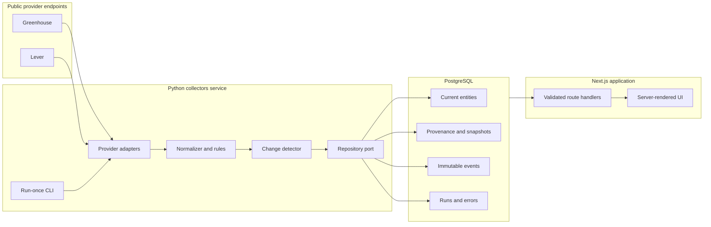
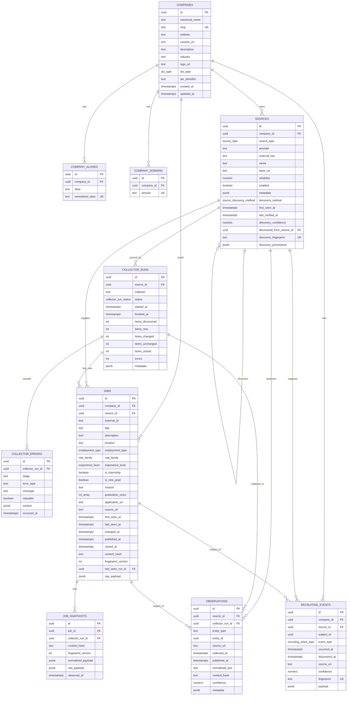
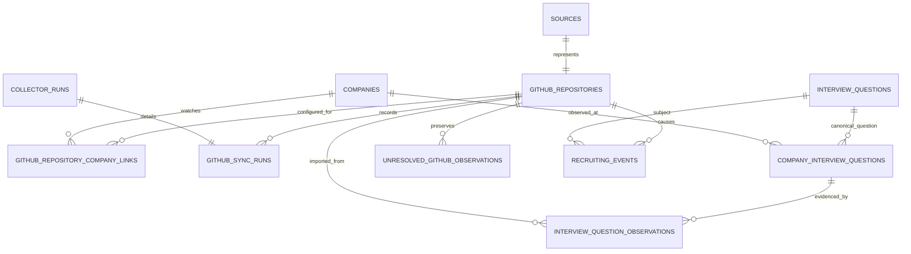
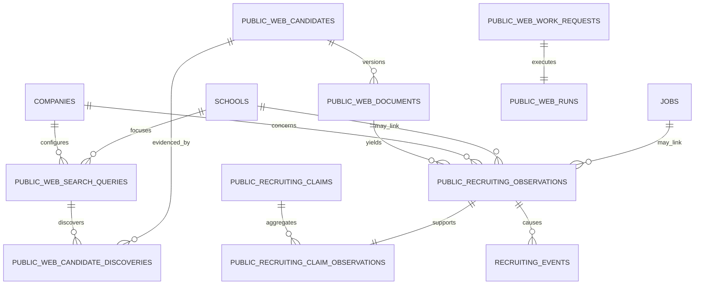
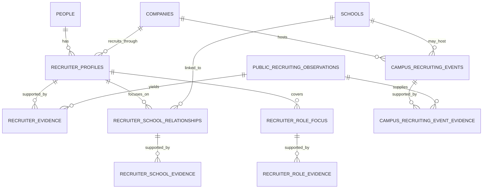
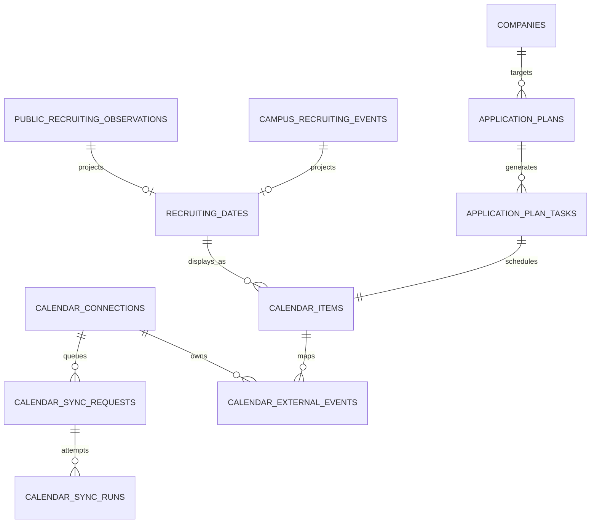

# RecruitIntel system design

## Decision summary

Create a new monorepo at the current workspace root. The directory is empty and none of the nearby repositories is an appropriate base. The system will use:

- Next.js/TypeScript for the product-facing web application and API routes.
- Python for collection, normalization, change detection orchestration, and future analytics.
- PostgreSQL as the system of record and coordination boundary.
- Plain versioned SQL migrations compatible with PostgreSQL/Supabase.
- A small PostgreSQL scheduler plus typed Python dispatcher for continuous collection and recovery.
- Provider adapters over a shared async HTTP client. External services never write directly to database tables.
- A direct-source-first discovery path that operates without a paid search API. General web search
  is supplemental and `ZERO_COST_MODE=true` is the runtime default.

Milestone 1 deliberately has no Redis, Celery, message broker, vector search, LLM, authentication, recruiter intelligence, GitHub watcher, alert engine, or ML runtime.

## Architectural boundaries



### Dependency rules

- Provider adapters may depend on HTTP and normalized collector contracts, but not PostgreSQL.
- Normalization and fingerprinting are pure functions.
- Persistence is behind a repository protocol; unit tests use an in-memory implementation.
- Only the PostgreSQL repository owns transaction and SQL details.
- Web route handlers validate inputs with Zod and query through a small server-side data access package.
- The browser never receives `raw_payload` or collector error internals.
- Cross-language vocabularies are defined once in SQL/docs and mirrored in generated or tested TypeScript/Python enums. Milestone 1 includes parity tests where generation would add more machinery than value.

## Discovery priority and source graph

The canonical discovery order is known source, official ATS/API, known company careers page,
bounded direct-domain discovery, GitHub/university sources, optional local/free search, then an
optional commercial provider. RecruitIntel must remain useful when the final two tiers are absent.

The existing `sources` table is the durable `SourceEndpoint` graph. Migration 0009 adds discovery
method/fingerprint, first-seen/last-verified time, confidence, bounded provenance, and an optional
parent source. Configured company careers URLs and company-homepage seeds become monitored source
knowledge. Permitted fetched pages can deterministically yield same-domain recruiting pages and
recognized ATS endpoints. Rediscovery is idempotent; source knowledge does not itself create jobs,
observations, claims, or recruiting facts.

```text
Company -> SourceEndpoint -> Collector or public candidate -> evidence/facts
              |                    ^
              +-- discovered -----+
```

Milestone 8 adds an additive canonical job graph after source collection:

```text
Company -> SourceEndpoint -> SourcePosting (`jobs`) -> CanonicalOpportunity
                                |                         |
                                +-> snapshots/evidence   +-> active user-facing count
```

Every source posting receives a singleton opportunity transactionally. A bounded resolver may later
merge memberships using only validated provider-native identity, an exact official application URL,
or an explicit exact official cross-reference. Source postings and temporal resolution lineage are
never deleted by canonicalization. Source authority and collection completeness are reviewed,
versioned capabilities, so weak disappearance or partial collection cannot close an opportunity.
See `docs/canonical-job-graph.md` for the schema, lifecycle, correction, and API contracts.

Known ATS/company-career coverage short-circuits equivalent general-search work. Greenhouse and
Lever are the currently executable ATS adapters; recognition of other ATS URL families remains
fail-closed until their collectors and policies are implemented. Future explicit browser imports
use the same source graph with user/browser provenance rather than a parallel monitoring system.

`SearchProvider` remains provider-neutral, but search is a supplemental candidate source only.
Static fixtures are development-only, an operator-controlled SearXNG instance is optional and
requires upstream-engine review, and You.com remains a disabled optional adapter. Provider-returned
URLs cannot bypass source policy, pinned DNS/redirect/robots transport, or normal processing.
`docs/search-provider-integration.md` and `docs/zero-cost-discovery.md` are the canonical contracts.

Permitted company pages can yield bounded schema.org `JobPosting` JSON-LD. Those postings are
attached to a durable company-careers SourceEndpoint and then enter the same singleton/resolver
path. They do not bypass source policy, robots rules, pinned transport, or provider throttling.

## Collector lifecycle

Every collector follows one observable lifecycle:

```text
discover() -> fetch() -> normalize() -> fingerprint() -> persist()
```

For ATS boards in Milestone 1, `discover()` resolves enabled source configurations already stored in PostgreSQL. `fetch()` retrieves a complete public board response. `normalize()` maps provider payloads to `NormalizedJob`. `fingerprint()` hashes a canonical serialization. `persist()` delegates to the repository.

The runtime contract is:

1. Create a `collector_runs` row.
2. Obtain a per-source PostgreSQL advisory lock so the same board cannot sync concurrently.
3. Fetch with an explicit timeout, bounded concurrency, retryable-status policy, rate limit, and identifying user agent.
4. Validate and normalize every posting.
5. In a transaction, upsert each normalized posting:
   - missing identity: reject and record a collector error;
   - new identity: insert job + snapshot/observation + `JOB_OPENED`;
   - same identity and same hash: update only liveness/run markers;
   - same identity and different hash: update job + snapshot/observation + `JOB_CHANGED`;
   - previously closed identity: reopen and emit `JOB_OPENED` with a reopening marker.
6. Only after the complete board fetch and all required persistence succeeds, close active jobs from that source not seen in this run and emit `JOB_CLOSED` events.
7. Finalize run counts and status.

A failed HTTP request, parse failure that makes the response incomplete, cancelled run, or failed transaction never executes the close phase. This prevents an outage or response-shape change from appearing as mass job closures.

### HTTP safety

Milestone 1 adapters build URLs from fixed provider base URLs plus validated tenant identifiers. They do not accept arbitrary fetch URLs. This removes the main SSRF path. The shared client additionally:

- permits HTTPS only;
- uses fixed allowlisted provider hosts;
- applies connect/read/write/pool timeouts;
- has bounded retries with jitter for transient failures and `429`;
- respects `Retry-After` when present;
- caps response size;
- uses bounded concurrency and provider-specific rate limits;
- emits structured logs without response bodies or secrets.

## Deterministic normalization

### Text and hash rules

Fingerprint input uses a versioned canonical JSON object containing meaningful source-derived job content. Before hashing:

- Unicode is normalized to NFKC.
- leading/trailing whitespace is removed;
- internal whitespace runs are collapsed for plain-text fields;
- HTML descriptions are sanitized and converted to stable normalized text for hash input;
- list values are normalized and sorted when their order is not meaningful;
- tracking parameters and URL fragments are removed from application URLs;
- null and empty values are represented consistently;
- JSON keys are sorted and encoded as UTF-8.

The content fingerprint is SHA-256 and includes a `fingerprint_version`. Provider identity (`source_id + external_id`) and content identity are intentionally separate.

### Role classification

Role family, internship, new-grad, and experience level are pure, versioned rules. Title evidence has priority; description evidence is supplementary. Unknown or conflicting cases become `OTHER`/`UNKNOWN`, not a fabricated guess. Rule versions are persisted so historical feature construction can reproduce what the system knew at the time.

## Provenance model

`sources` identifies where data came from and how reliable that source class is considered. It does not assert truth. `observations` records a source-derived claim and links it to the relevant entity. `job_snapshots` stores the job-shaped normalized/raw evidence for meaningful content states. `recruiting_events` records immutable transitions.

For an ATS job, the provenance chain is:

```text
source -> observation -> job snapshot -> current job
                    \-> recruiting event
```

The current `jobs` row is a projection optimized for queries. Snapshots and events preserve history. Raw payloads remain untrusted JSON and are never rendered directly.

## Event identity

Event fingerprints prevent duplicates at the database level. A fingerprint is SHA-256 over a versioned canonical object:

```text
event_type + company_id + subject_type + subject_id + source_id + causal_content_hash
```

`JOB_OPENED` uses the initial/reopening job content hash plus an opening sequence marker. `JOB_CHANGED` uses the new content hash. `JOB_CLOSED` uses the source sync run that established absence. The unique `recruiting_events.fingerprint` constraint makes retrying a transaction or command idempotent.

## Database ERD

The solid Milestone 1 core is shown first. Dashed/future concepts are documented afterward and should not be migrated yet.



### Database constraints and indexing

- UUID primary keys use `gen_random_uuid()` from `pgcrypto`.
- `company_aliases.normalized_alias` and `company_domains.domain` are unique.
- `sources` is unique on `(provider, external_key)` for ATS boards.
- `jobs` is unique on `(source_id, external_id)`.
- `job_snapshots` is unique on `(job_id, content_hash)`; unchanged polls do not duplicate full snapshots.
- `recruiting_events.fingerprint` is unique.
- confidence/reliability values have `0 <= value <= 1` checks.
- URLs have conservative scheme checks in SQL and stronger application validation.
- open-job queries use a partial index on `(company_id, published_at desc)` where `closed_at is null`.
- event timeline queries use `(company_id, occurred_at desc, id desc)`.
- collector run queries use `(source_id, started_at desc)`.
- all `updated_at` values are maintained by a trigger.

PostgreSQL cannot enforce a polymorphic `observations.entity_id` foreign key. In Milestone 1, observations are job observations, so the table also has a nullable `job_id` foreign key and a check tying `entity_type = 'JOB'` to it. A later milestone can add explicit association tables rather than weakening integrity.

## Milestone 2 ERD extensions

Migration `0002_github_interview_intelligence.sql` adds:



Canonical questions, company associations, and source observations are separate by design. Commit-scoped fingerprints make observations and events idempotent. Unknown company names and conflicting question identities enter `unresolved_github_observations` rather than being guessed or dropped. `company_interview_question_analytics` is a stable projection for count, source, and recency queries.

## Milestone 3 ERD extensions

Migration `0003_public_web_intelligence.sql` adds:



Candidate URLs, immutable extracted content, source observations, and aggregate claims are separate identities. Multiple independent sources may support or conflict on one claim. The current jobs projection is linked only by an unambiguous canonical URL match and is never duplicated by public-web ingestion. Exact contracts and safety behavior are documented in `docs/public-web-intelligence.md`.

## Milestone 4 ERD extensions

Migration `0004_recruiter_campus_intelligence.sql` adds:



Person and recruiter identity, source evidence, and school/role/event projections are separate. Exact normalized identity and evidence fingerprints provide retry deduplication; ambiguous identities remain unresolved. Relationship strength is a transparent categorical projection over immutable evidence. Milestone 4 reuses `WEB_PROCESS` and existing observations rather than introducing another crawler. Exact contracts and operating rules are documented in `docs/recruiter-campus-intelligence.md`.

## Milestone 5 ERD extensions

Migration `0005_recruiting_calendar.sql` adds:



Recruiting facts, owner actions, generated plan metadata, provider connections, and external event
identity remain separate. Source fingerprints deduplicate intelligence projections; owner/date and
plan sequence constraints prevent projection/task duplication. External mappings and deterministic
Google event IDs make provider retries idempotent. Refresh credentials use a versioned encryption
abstraction and access tokens remain ephemeral.

## Milestone 6 identity and ownership extensions

Migration `0006_identity_privacy_audit_instrumentation.sql` adds the canonical `users`,
`user_sessions`, `user_identities`, and `auth_verifications` contract for pinned Better Auth 1.7.1.
Every private Calendar/planning/provider row now carries a valid user foreign key, including
denormalized owner keys on task, mapping, request, and run tables. Compound foreign keys make
cross-user graph construction invalid at the database boundary.

Shared intelligence remains unowned. Personal routes derive user identity from an HttpOnly session
and never accept a user identifier in browser input. Operational mutation routes use an admin user
or a hashed, scoped service principal; admin status does not bypass private owner predicates.

The migration also adds append-only minimized `audit_events`, private `product_events`, future
ranking decision/impression denominators, privacy request lifecycle, watchlist ownership, and the
minimal hashed/expiring/revocable browser-extension grant foundation. Exact security, privacy, and
manual auth setup are documented in `docs/identity-privacy-audit.md`.

## Milestone 7 orchestration and source-governance extensions

Migration `0007_durable_orchestration_source_governance.sql` adds `schedules`, `work_items`,
`work_attempts`, `dead_letters`, `source_policies`, `source_policy_host_rules`, pragmatic shared
`rate_limit_states`, source-health samples/state/incidents, and database-role-to-service-principal
bindings. WorkItems deliberately contain orchestration coordinates rather than domain payloads.
Existing GitHub, public-web, Calendar, collector, and external-event tables remain the source of
domain state, history, ownership, and side-effect idempotency.

The scheduler transactionally enqueues one fingerprinted occurrence using PostgreSQL-authoritative
time. Workers claim eligible lanes with `FOR UPDATE SKIP LOCKED`; every claim has an attempt row and
fenced lease token. Short tasks use a bounded timeout and long lease. ATS, GitHub, search, and
Calendar tasks may heartbeat. The scheduler reaper recovers expired leases and reconciles linked
legacy request/run status. Retry classification is deterministic and respects a bounded provider
`Retry-After`; exhausted or permanent failures become dead letters with redacted diagnostics.

Source policy is fail-closed at enqueue and again immediately before outbound execution. Unknown,
`REVIEW_REQUIRED`, and `BLOCKED` providers cannot run automatically. General public-web requests
use an exact-version `httpx`/`httpcore` transport that resolves once, rejects mixed unsafe address
sets, connects only to a validated address, retains the original HTTP Host and HTTPS SNI/certificate
hostname, disables ambient proxies, and independently resolves every redirect and robots request.
The complete contract is documented in `docs/orchestration-source-governance.md`.

Search-provider cost policy is enforced twice. In the runtime registry, zero-cost mode rejects
providers marked paid or ineligible. In PostgreSQL, each provider/credential-slot call reserves its
daily/monthly request, estimated-cost, and paid-spend budget transactionally before network I/O.
`FREE_TIER` usage cannot request paid overage and `PAID` usage cannot execute in zero-cost mode.
Missing commercial credentials never prevent startup.

## Future ERD extensions

Later migrations add:

- `alerts` and notification deliveries.
- application tracking CRM and analytics projections.

These tables link back to `sources`, `observations`, and `recruiting_events`; they do not introduce alternative provenance systems.

## API design

Product routes are read-only except for an explicit collector-run command intended for local/admin use. The first UI uses:

- `GET /api/companies`
- `GET /api/companies/[id-or-slug]`
- `GET /api/companies/[id-or-slug]/jobs`
- `GET /api/companies/[id-or-slug]/events`
- `GET /api/jobs`
- `GET /api/events`
- `POST /api/collectors/run` only when a server-side admin token is configured; the CLI is the default operational interface.

Responses use `{ data, meta? }` and errors use a stable `{ error: { code, message } }` shape. Query parameters are validated with Zod. Pagination is cursor-ready, though a bounded `limit/offset` is sufficient for the seed-sized Milestone 1 UI.

Milestone 2 adds typed repository attachment/listing, durable sync requests, deterministic company question analytics, and question provenance detail. As of Milestone 6, mutation routes require an authenticated admin or a hashed `ADMIN_MUTATE` service principal; `GITHUB_TOKEN` is never exposed to the web application. Exact frontend response shapes are documented in `docs/github-intelligence.md`.

Milestone 3 adds typed public-web intelligence, observation/detail, claim, and search-state reads plus admin-authenticated durable search/fetch requests. The browser receives normalized bounded evidence and provenance, never raw HTML. Exact frontend response shapes are documented in `docs/public-web-intelligence.md`.

Milestone 4 adds typed recruiter/evidence and company/school/campus-event reads plus admin-authenticated manual recruiter/evidence writes. Responses always expose source provenance, categorical relationship reasons, and freshness. Exact frontend response shapes are documented in `docs/recruiter-campus-intelligence.md`.

Milestone 5 adds owner-scoped recruiting-date/calendar/application-plan APIs plus a provider-neutral,
one-way Calendar sync queue. OAuth routes retain state and refresh credentials only on the server;
provider calls run in the finite Python worker. Exact contracts are documented in
`docs/recruiting-calendar.md` and setup is in `docs/google-calendar-integration.md`.

Milestone 6 adds pinned Better Auth session persistence, reusable user/admin/service actor
resolution, authenticated ownership for every Milestone 5 personal route, compound ownership
constraints, service principals, privacy request/deletion contracts, an append-only audit ledger,
cross-language log/diagnostic redaction, and privacy-safe instrumentation for current product
behaviors. `GET /api/me` exposes the current identity; Better Auth owns `/api/auth/*`. Public
intelligence response shapes are otherwise unchanged.

Milestone 7 adds authenticated internal/admin read APIs for safe orchestration metadata, schedules,
source policies, source health, and incidents. Only global dead letters may be administratively
requeued; private Calendar work cannot be inspected or requeued through these APIs. Existing
product/public response shapes are unchanged.

## Local development and deployment

Docker Compose runs PostgreSQL only. The web app and Python collector run on the host for fast feedback. Migrations and seed SQL are explicit scripts. Seed data includes recognizable companies and synthetic local jobs/events, clearly labeled as seed/demo records. Basic UI development therefore needs no network or provider credentials.

Continuous work uses two finite commands suitable for a supervised service: `scheduler` enqueues
due `INTERVAL`/`DAILY_AT` occurrences and reaps expired leases; `worker` claims configured lanes and
dispatches enumerated WorkTypes to typed handlers. Product routes still only enqueue durable domain
requests. The scheduler and worker can also run `--once` for deterministic local and smoke tests.
Deployment, role binding, backup, reconciliation, and recovery are documented in
`docs/milestone-7-orchestration-operations.md`.

The default environment sets `ZERO_COST_MODE=true`. No search API credential is required. An
optional `SEARXNG_BASE_URL` registers only an operator-controlled adapter; policy and budget remain
fail-closed until the instance and every enabled upstream engine are reviewed. Direct-source, ATS,
GitHub, university, Calendar, and privacy work continue when SearXNG is absent or unavailable.

## Security and trust boundaries

- External payloads are untrusted and validated with Pydantic.
- Raw HTML is sanitized; the UI renders normalized text, not provider HTML.
- Fixed provider hosts and validated tenant slugs prevent arbitrary URL fetching in Milestone 1.
- Arbitrary public URLs are restricted to HTTP/HTTPS and approved ports; resolved address sets must
  be entirely public. The actual socket is pinned to the approved address while Host, SNI, and TLS
  certificate validation retain the original hostname. Every redirect and robots request repeats
  policy and resolution checks. Ambient proxies are disabled, requests are rate/size/time bounded,
  and content is never rendered or executed.
- LinkedIn URLs may be retained from permitted search results or manual input, but the fetcher blocks LinkedIn hosts and redirect targets before any HTTP request. No cookies, authenticated scraping, browser automation, CAPTCHA bypass, or anti-bot circumvention exists.
- Secrets are read from environment variables and `.env` is ignored.
- Authentication and Google Calendar OAuth use separate clients and grants. Better Auth provider
  tokens are removed before persistence; Calendar refresh credentials remain envelope-encrypted.
- Structured TypeScript/Python logs, API errors, provider errors, and persisted worker diagnostics
  pass through shared golden-tested secret/PII redaction behavior.
- Personal route access always includes the authenticated user predicate. Admin status does not
  imply access to another user's private content.
- Scheduler, global collector, Calendar, privacy-cleanup, and trusted web-app database capability
  roles are explicit and bound to active service principals and allowed work lanes.
- No collected text is passed to an LLM or treated as instructions.
- Confidence is an internal ranking attribute, not a truth claim.

## Future ML compatibility

No model is trained in Milestone 1. Immutable events, source provenance, collector run outcomes, content versions, and open/close timestamps provide the event-time data needed later. Feature generation must use only facts discovered at or before a prediction cutoff. Time-based train/validation/test splits and point-in-time joins are mandatory to prevent leakage.
